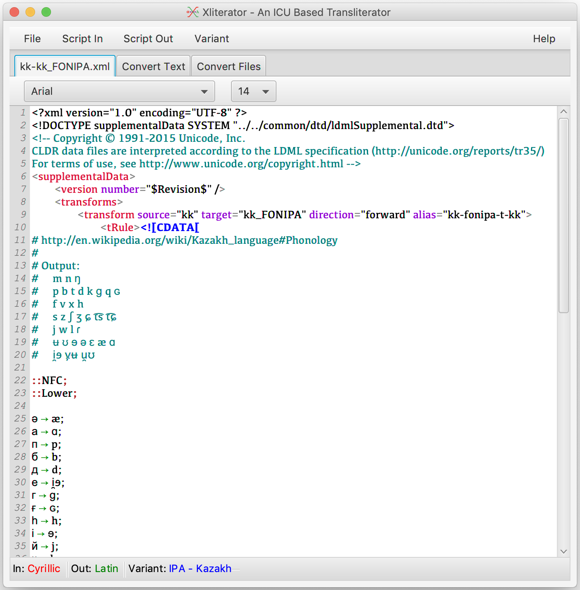
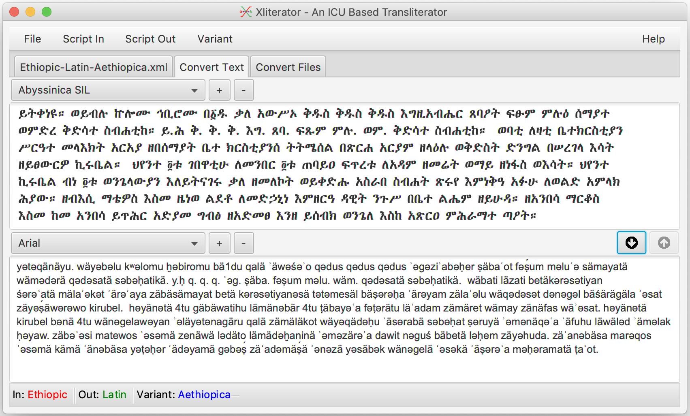
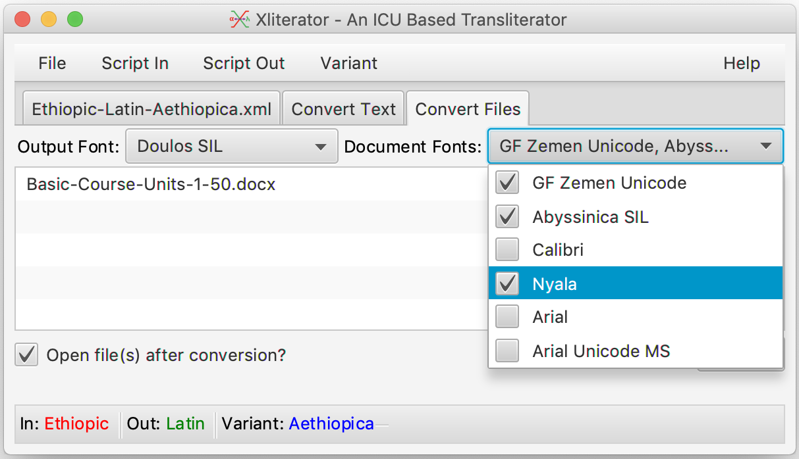

<h2>Xliterator</h2>
A general purpose (eventually) [ICU](http://site.icu-project.org/) based transliteration utility.

## Download
* [Direct download of v0.5 here.](https://github.com/geezorg/Xliterator/releases/download/v0.5.0/Xliterator-0.5.0-full-gui.jar)
* [Read the notes on the latest updates.](https://github.com/geezorg/Xliterator/releases/tag/v0.5.0)

## Usage
The Xliterator comes with a collection of the [CLDR 35.1 transforms collection](https://github.com/unicode-org/cldr/tree/master/common/transforms).  These packaged transliteration files may be selected via the **Script In** , **Script Out** and **Variant** menus.  Once a system has been selected, it will be applied for both text and file conversions.

### Mapping Editor Tab
The mapping editor offers syntax highlighting for ICU files in either XML or text formats.  An external file may be loaded
in the usual way via **File &gt; Open ICU File...** .  An internal transliteration system selected via the **Script In** , **Script Out** and **Variant** menus can be loaded file **File &gt; Load Selected Transliteration** .  Once a file is loaded, the **Script In** menu will be set to the **Use Editor** option.

### Convert Text Tab
Text can be typed into an editor window, or pasted from another source, then converted in the *forward* direction with the down arrow button (⬇).  If supported by the selected transliteration system, reverse transliteration can be performed from the lower to upper windows using the up arrow button (⬆).

### Convert Files Tab
Selected files will be converted under the selected transliteration system (or editor if chosen).  Transliteration is only performed on targed fonts selected under the **Document Fonts** menu.  The **Output Font** will be applied to converted text.  The selected files are not modified, output will appear in a new file using the source file name with the output script name appended.

### Limitations
The Xliterator does not presently support ICU transliteration files that import other files.  This will be addressed in a near term update.

### Troubleshooting

If nothing happens when you double click the "Xliterator-0.5.0-full-gui.jar" file, and you are certain that
Java is installed on your Windows system, you likely need to fix the Window's registry.  Try downloading and launching
[Jarfix](https://johann.loefflmann.net/en/software/jarfix/) to fix the registry.

### Issues
Issues can be reported to the author directly, or via the GitHub [issues tracker](https://github.com/geezorg/Xliterator/issues)
for the project.

